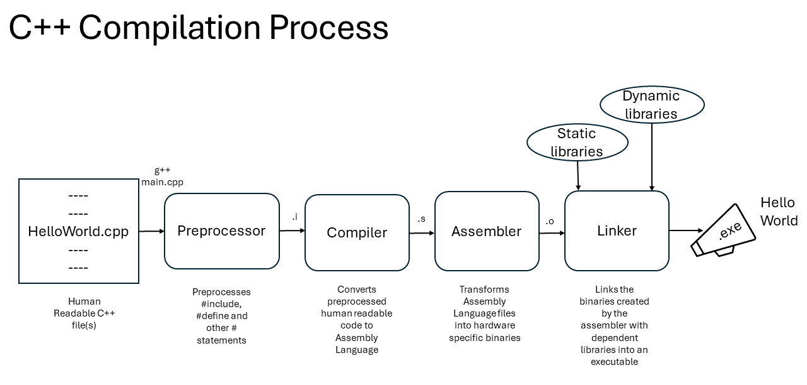

# Introduction 

1. Illustrate the components of a C++ workspace and demonstrates the build process shown below

2. Set up a Visual Studio workspace to build, run, and debug code. 
3. Employ colcon to manage builds. 

# Process 
1. Install VS Code 
     https://code.visualstudio.com/download
2. Set up VS Code for C++ in Linux
     https://code.visualstudio.com/docs/cpp/config-wsl
    While Windows is a perfectly acceptable environment for C++ in general, it is worthwhile to set up for Linux because most open source robotics applications are better supported in Linux. 
     1. Install WSL Extension for VS Code: https://marketplace.visualstudio.com/items?itemName=ms-vscode-remote.remote-wsl
     2. Install WSL in Windows: `wsl --install` in Powershell. Write down your username and password!! 
3. Set up Hello World Workspace in `Linux/Ubuntu/home/<username>` folder
     - `mkdir Software/HelloWorld/src`
4. Write compile and run C++ code 
     1. `touch HelloWorld.cpp`
     2. Write main function that prints Hello World
     3. Compile code into executable, see [References][2]: `g++ -o HelloWorld src/HelloWorld.cpp`
     4. Run executable: `./HelloWorld`
     5. Celebrate! 
5. Set up VS Code configurations. See [Components/Configurations] 
     1. Test Run[Ctrl+F5] and Debug[F5] 
6. Set up version control. We'll use Git.
     1. Install Git 
          - `sudo apt install git-all`
          - `git --version`
     2. Create a repository for HelloWorld. In the HelloWorld folder.
          - `git init`
     3. Commit code
          -  `git add .`
          -  `git commit -m "Say Hello World"`
     4. Push to GitHub (optional and homework) 

7. Link code to an External Library outside the workspace. We'll use Eigen: A C++ template library for linear algebra: matrices, vectors, numerical solvers, and related algorithms.
     1. Download Eigen to `~/Software`, i.e. outside this workspace
          - `git clone https://gitlab.com/libeigen/eigen.git`
     2. Write a program `EigenAdd.cpp` to initialize a 2x2 matrix, assign numbers to 3 of its elements, and set a fourth to a sum of two elements. The code also prints the elements of the matrix when run.
     3. Build and execute `EigenAdd.cpp` by including the Eigen libraries, using the -I option
          - `g++ -I ~/Software/eigen src/EigenAdd.cpp -o EigenAdd`
          - `./EigenAdd`
8. Update VS Code configurations to include the Eigen external library 
     1. Add `"~/Software/eigen/**"` to `c_cpp_properties.json` so that Intellisense has knowlege of the headers. 
     2. Update the g++ command defined in `task.json` to include `"~/Software/eigen/**"`
9. Set up extensions: Use `Ctrl + Shift + P` to go to the Command Pallete. Extension settings are recorded in `.vscode/settings.json`. 
     1. C/C++ Extension Pack 
     2. GitLens
     3. GitHub Copilot
10. Define header files 
     1. Move HelloWorld implementation into a class with a header and C++ file
     2. Define methods to say "Hello World" and "Hola Mundo"
11. Define build parameters in `CMakeLists.txt` and compile both `HelloWorld.cpp` and `EigenAdd.cpp` into their respective executables.
     1. Write `CMakeLists.txt` 
     2. Make build system binaries, such as the Makefile, in the `build` folder. 
          - If the build folder does not exist, `mkdir build`
          - `cd build`
          - `cmake ..` 
     3. Build CMake binaries into executables. Within the build folder run
          - `cmake --build .`
          - Confirm that executables for HelloWorld and EigenAdd are created in the build folder
12. Add Unit Tests 
     1. Create a tests folder 
     2. Define `HelloWorldTest.cpp` to test the `inEnglish()` and `inSpanish()` outputs
     3. Update `CMakeLists.txt` to fetch GTest and build `HelloWorldTest`, the executable that runs google tests
     4. Clean and rebuild from the `build` folder, this time with tests
          - `make clean`
          - `cmake ..`
          - `cmake --build .`
     5. Run the tests `./HelloWorldTest`
     6. If all tests pass, then celebrate. Else, iterate!

# Components 
The workspace, aka `${workspaceFolder}`, consists of `.vscode`, `.git`, and `src` folders, as well as top-level files such as this Readme

## Software 
1. src/run_helloWorld.cpp contains a main() function that prints Hello World in English and Spanish. 
2. include/HelloWorld/HelloWorld.hpp and src/HelloWorld.cpp define and implement a HelloWorld class, respectively. The HelloWorld class contains methods to print "Hello World" and "Hola Mundo"
4. tests/HelloWorldTest.cpp contais unit tests for the HelloWorld application.
3. src/EigenAdd.cpp contains a main() function to initialize a 2x2 matrix, define, and print out its elements

## Configurations
The following configurations pertain to VS Code and are defined in the .vscode folder
1. c_cpp_properties.json specifies the settings and properties for the C/C++ language extension in Visual Studio Code. It allows you to customize various aspects of your C/C++ development environment, such as include paths, compiler options, and IntelliSense settings. 
    - The ${workspaceFolder} represents this folder, the root folder of your workspace.  
2. tasks.json defines tasks that run when the user clicks Run or Run and Debug in VS Code. Run tasks can range from building your project, running scripts, launching external programs, to running custom commands. In this project, task.json defines the g++ command that is executed to build the code. 
3. launch.json outlines the process that runs in VS Code when Run/Debug (F5) is executed. It specifies which debugger to us, which executable to run, and the arguments for the executable. It also identifies any preLaunch tasks, such as compiling the code that gets debugged. preLaunch tasks may be defined in tasks.json.  

CMakeLists.txt holds the build configurations, including the versions CMake and C++ versions, the location of dependencies, compiler arguments, and the names of executables. 

# References 
1. VS Code tutorials for getting started with C++ are detailed and up to date: https://code.visualstudio.com/docs/cpp/introvideos-cpp 
     1. [Keyboard Shortcuts](https://code.visualstudio.com/shortcuts/keyboard-shortcuts-windows.pdf)
2. Mike Shah has great video that details the C++ compilation process: https://www.youtube.com/watch?v=ksJ9bdSX5Yo&t=1924s. I highly recommend this channel for learning and advancing C++ skills. 

 